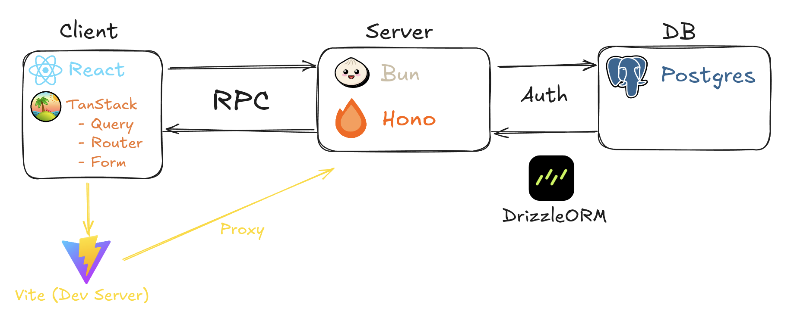

# Murderous Hack

**Murderous Hack** is a forum for discussing tech related topics.

> **Quote**: A teacher once said: "Das ist ein mörderischer Häck"

## Tech Stack

## Architecture

## Key Features

-   Paginated queries with [InfiniteQueries](https://tanstack.com/query/latest/docs/framework/react/guides/infinite-queries)
-   Caching and cache-control
-   Optimistic updates

## Reminder

-   **Backend Setup**: After each restart run the `bun start` command to spin up the Docker container and setup Drizzle ORM.
-   **API Testing**: First hit the `api/auth/login` endpoint with a POST request, before API testing.

## Deployment

1. Deploy frontend to Vercel (free tier)
2. Deploy backend to Railway or Render (free tier)
3. Use Neon or Supabase for PostgreSQL (free tier)
